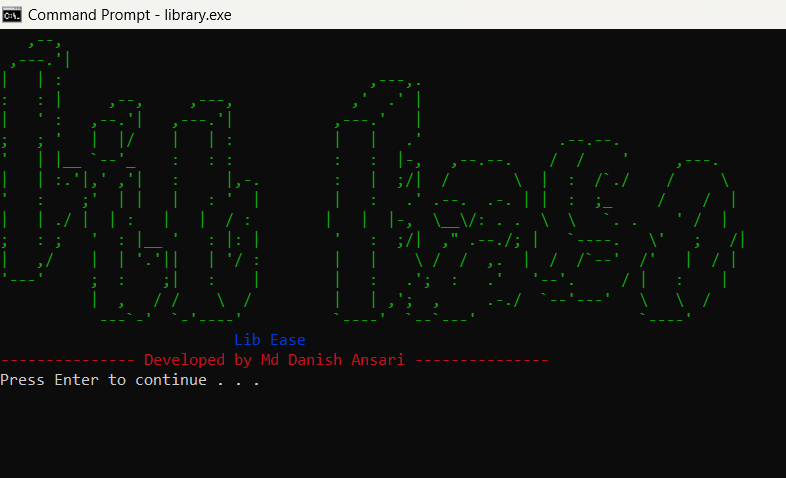

# LibEase: Library Management System

LibEase is a command-line application designed to facilitate the management of books within a library. 
Developed in C++, this system offers a comprehensive suite of functionalities to streamline the process of adding, displaying, searching, borrowing, and returning books.
Additionally, it provides robust user management capabilities, enabling the creation and modification of user profiles.

## Features

- **Add User**: Register new users into the system, complete with detailed profiles.
- **Edit User Profile**: Modify user information to ensure profiles remain current and accurate.
- **Add Books**: Catalog new books into the library's inventory with ease.
- **Display Book Details**: View detailed information about each book in the library.
- **Search for Books**: Efficiently search the library's catalog to find specific books by title, author, or other criteria.
- **Manage Borrowing and Returning of Books**: Facilitate the borrowing process and track the return of books to ensure accurate inventory management.

## Usage

### Clone the Repository

1. Open a terminal or command prompt.
2. Change the current working directory to the location where you want to clone the project.
3. Run the following command to clone the repository:

```
git clone https://github.com/danish-ans/LibEase
```

### Build

```
 make 
```
windows 
```
mingw32-make
```

### Clean the data files

1. Open a terminal or command prompt.
2. Change the current working directory to the location where you have cloned the project.
3. Run the following command to clean the data files:

Linux User

```
make cleandatafolder
```

Windows User

```
mingw32-make clean-data-folder
```

### Run the exectable file
In the ./bin folder of your root directory find the library_system.exe file and run it.
